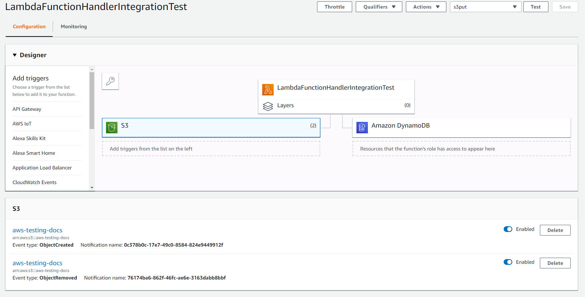

AWS lambda function for update DynamoDB using S3 trigger
==========================================================

When user adds/removes file from S3 backet, then the lambda function executes 
and it adds/removes record with file info from DynamoDB date base. 

DynamoDB
----------------------
Dynamodb table has following structure:
- Primaty index: packageId – type: String
- Sort key: originTimeStamp – type: Number
- Secondary indexes: filePath – type: String, fileType – type: String

Lambda Unit Tests
----------------------
- testHandleObjectCreatedRequest
- testHandleObjectRemovedRequest

Tests to chek lambda function behavoior with json S3 event.
Mockito library has been used to mock services and logger.

DynamoDB service Unit Tests
----------------------
- addItemToDateBaseDirectly

Test dynamoDBService and table info constants from the lambda.
Add new record to DynamoDB, find records and remove record.

Integration tests
----------------------
- uploadFileToS3

Uploads a file to S3 and checks that new record has been added to DynamoDB.

- uploadAndDeleteFileFromS3

Uploads a file to S3 and checks that new record has been added to DynamoDB.
Delete file from S3 and checks that the record has been deleted from DynamoDB.

The file is povided by test parameter. S3 backet name and aws region are provided by
config.properties

